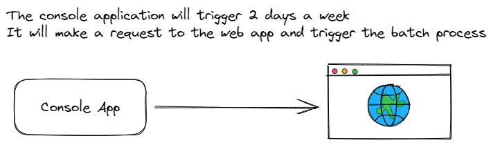

# Bridgestone Batch Payments Console Application

This application is responsible to trigger the batch payment.

The `production` branch contains the Live environment

The `development` branch is used for th QA environment / testing

#

## Contribution

Please create a branch from the `production` branch with one of the following naming convention for the branch name

1. `feature/example` When creating a new feature for the application
2. `fix/example` Fixing a bug with the application
3. `hot_fix/example` When a bug fix needs to be taken live immediately 
4. `update/example` Working on a update for application
5. `develop/example` Working on a already developed feature of the application
6. `testing/example` Testing of a feature/development or an issue